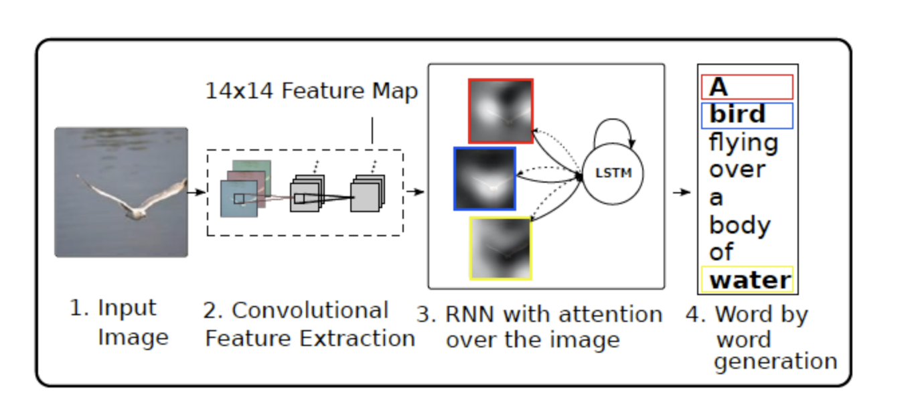
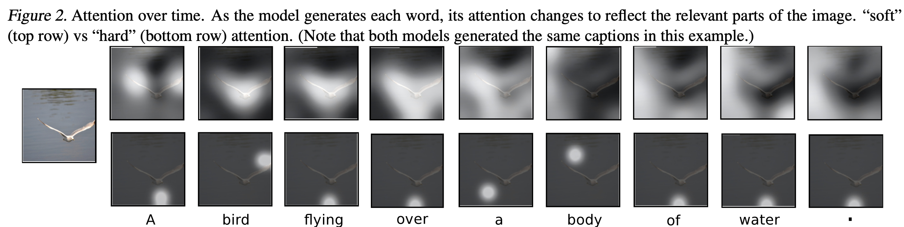

# Show, Attend and Tell: Neural Image Caption Generation with Visual Attention

This repository contains an implementation of the "Show, Attend and Tell" model for generating descriptive captions for images using a neural network with visual attention. By integrating a Convolutional Neural Network (CNN) for image feature extraction and a Recurrent Neural Network (RNN) with an attention mechanism, the model dynamically focuses on different parts of an image while generating each word of the caption. This approach results in more accurate and contextually relevant image captions.

## Features

- **Image Feature Extraction:** Utilizes a pre-trained CNN to extract high-dimensional feature vectors from input images.
- **Attention Mechanism:** Incorporates an attention mechanism to focus on specific image regions during caption generation.
- **Caption Generation:** Uses an LSTM network to generate captions word by word, informed by the attention-weighted image features.

## Architecture



## Usage

1. Clone the repository:
   ```sh
   git clone https://github.com/yourusername/show-attend-and-tell.git
   ```

2. Install the required dependencies:
   ```sh
   pip install -r requirements.txt
   ```

3. Run the Flask application:
   ```sh
   python app.py
   ```

4. Open your web browser and navigate to `http://localhost:5000` to interact with the application.

## Getting Started

To get started with using this project, follow the installation instructions above. Additionally, you may want to explore the following files:

- `app.py`: Main Flask application file.
- `templates/`: Contains HTML templates for the web interface.
- `static/`: Directory for static files (e.g., images, CSS).
- `model.py`: Implementation of the image captioning model.
- `utils.py`: Utility functions for image preprocessing and caption generation.

## Example



## References

- [Show, Attend and Tell: Neural Image Caption Generation with Visual Attention](https://arxiv.org/abs/1502.03044) by Kelvin Xu et al.

## License

This project is licensed under the MIT License - see the [LICENSE](LICENSE) file for details.

---
